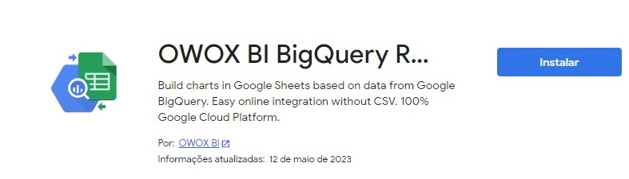

# Web Scraping Challenge

## Índice

- [Introdução](#sobre)
- [Sobre o Projeto](#caminho)
- [Considerações Finais](#final)

### [Link Sheets](https://docs.google.com/spreadsheets/d/1cZ-4FipfoxNne5vdjtY4VsFkLCU6HLBrgHqYqqWI2JU/edit#gid=1509070499)

## Introdução 

O case tecnico consiste em realizar a extração das informações da base de dados listada no website:

https://steamdb.info/sales/

Armazenar os dados extraidos no Google BigQuery, em seguida exportar ou conectar esses dados em um Google Sheets e gerar um link para compartilhamento.

## Sobre o Projeto 

O projeto foi construido utilizando python para a extração dos dados do site. Como o site é protegido pelo sistema anti-bot do Cloudflare, foi utilizando a biblioteca <b>undetected_chromedriver</b> em conjunto com <b>selenium</b> para extração dos dados. 
Após a extração, os dados são tratados, removendo informações inconsistentes. Depois é utilizado o <b>pandas</b> para transformar os dados em uma tabela e é realizado mais transformações nos dados.  
Com a tabela de dados pronta, é utilizado a biblioteca <b>pandas_gbq</b> para realizar a manipulação do Bigquery e <b>google.oauth2</b> para usar as credenciais do Google Cloud para autenticar no Bigquery. 
Por fim, é criado uma tabela no Google Sheets com compartilhamento de visualização público. Para realizar a transferencia dos dados do Bigquery para o Sheets é utilizado o plugin <b>OWOX BI BigQuery Reports</b>.

Com esse plugin é possivel realizar uma conexão entre a tabela do BigQuery e do Sheets. O plugin tambem tem a possibilidade de atualizar os dados da tabela do Sheets, deixando-o atualizado caso tenha mudanças na tabela do BigQuery.

## Considerações Finais 

Como não tenho autorização do site para realizar a extração dos dados pois site não permite a extração das informações <i>(de acordo com o FAQ)</i>, resolvi realizar a extração de dados somente da primeira lista de jogos. Uma alternativa de obter as informações seria utilizar alguma <a href='https://github.com/ValvePython/steam'>biblioteca</a> para obter as informações diretamente do steam, assim respeitando as politicas de uso do site steamDB.
